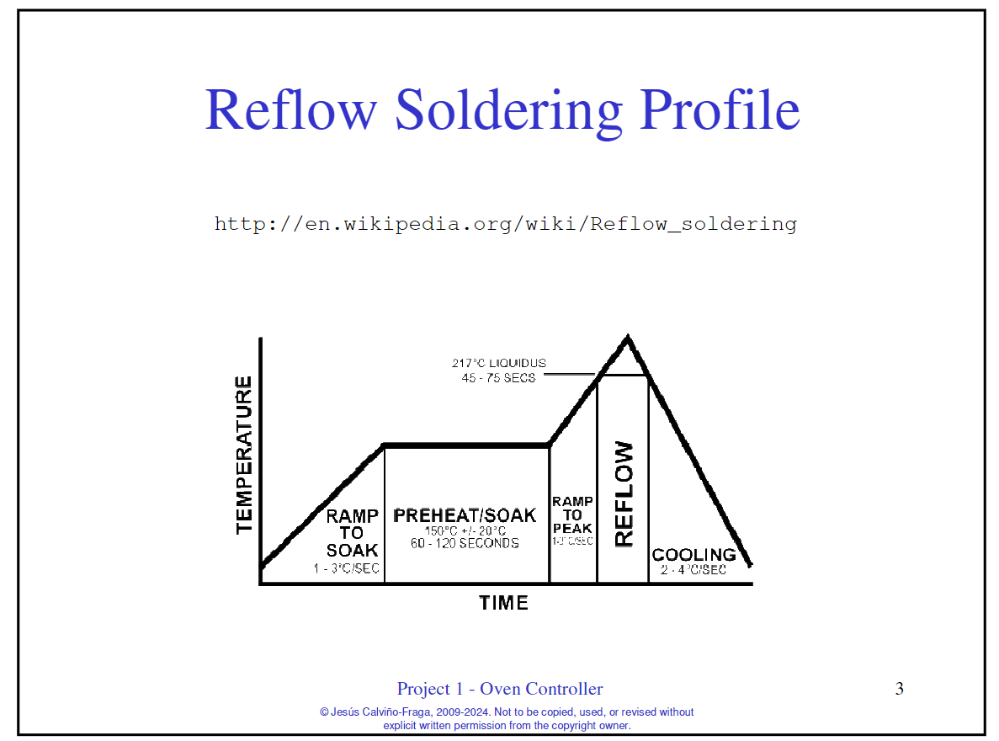

This is for ELEC 291 project 1

We can use file for any ideas and thoughts

These are what I(Ji) can think of so far:

1. circuit: 
    thermocouple:  for temperaure, cold junction (Use LM335), hot junction (put in the oven)
    SSR:           for oven, use n-mosfet 
    Opamp:         a difference Opamp, (2660 for VCC,VDD) gain should be less than 335 used for convert voltage 
                   from the thermocouple to ADC voltage  
    Buzzer:        same as lab2
2. software:
    5 states: 
    